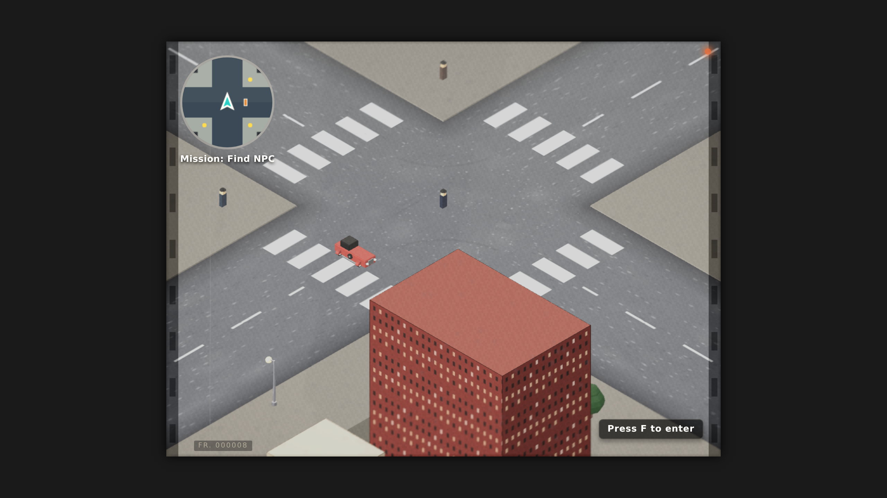

# GTA JS (ECS-lite) 🚗💥

[](https://github.com/LuoXiahong/gtalikegame/actions/workflows/deploy.yml)
[](https://luoxiahong.github.io/gtalikegame/)

A lightweight, high-performance, noir-flavored GTA-like game engine written in modern vanilla JavaScript, built around an **ECS-lite (Entity-Component-System)** architecture. Set in a procedurally generated 1930s-40s city, rendered through a live, tweakable retro film / kinescope effect — grain, flicker, scratches, and all.

🎮 **[Play the Live Demo](https://luoxiahong.github.io/gtalikegame/)**

The project follows a "Low effort / High impact" philosophy (clever PS2-era tricks over heavy simulation) to construct a living city simulation, featuring both a classic 2D top-down canvas mode and a modern 3D rendering mode powered by Three.js.

## Screenshots

<p align="center">
  
  &nbsp;
  
</p>

<p align="center">
  
</p>

---

## ✨ Features

*   **Procedural 1930s-40s vehicles** — `VehicleModelFactory` builds sedans, coupes, and panel vans from data-driven archetypes (separate rounded fenders, running boards, exposed round headlamps, whitewall tires) instead of licensed or overly-detailed 3D assets.
*   **Retro film / kinescope post-processing** — a custom `ShaderPass` layering film grain, gate jitter, flicker, animated scratches, dust, and vignette, with four live-tweakable presets (`off`, `subtle`, `classic`, `ruined`).
*   **Full internationalization** — UI strings translated across 5 locales (`pl`, `en`, `de`, `es`, `fr`) via a small custom `I18n` catalog system.
*   **Adaptive input UI** — on-screen touch controls auto-detected via pointer/hover media queries, with manual override in Settings.
*   **Dual rendering modes** — 2D top-down Canvas and full 3D (Three.js) sharing the same ECS world/state.
*   **Security-conscious UI layer** — HUD rendering has dedicated regression tests guarding against XSS injection through entity/display data.

---

## 📁 Directory Structure

```
/game
├── src/                    # Source code of the game
│   ├── core/               # Engine core (Game Loop, Time, EventBus, GameState)
│   ├── entities/           # Data-only entities (Entity, Player, NPC, Car)
│   ├── systems/            # Logic systems (Movement, AI, Render, Mission, Audio, Vehicle Models, Retro Film, etc.)
│   ├── world/              # Environment (World, Camera, Tilemap, Waypoints, Grid)
│   ├── input/              # Input management (InputManager)
│   ├── i18n/               # Translation catalogs & I18n helper (pl/en/de/es/fr)
│   ├── ui/                 # UI layers (HUD, MenuScreen, Options, UISettings)
│   └── main.js             # Application entry point / bootstrap
└── .github/
    └── workflows/          # CI/CD workflows (GitHub Pages deployment)
```

---

## 🏗️ ECS-lite Architecture

My core design strictly separates data from logic, allowing extreme flexibility and high optimization.

### Core Concepts

*   **Entities** are purely containers of data components (such as `transform`, `physics`, `visual`, `ai`). They **do not contain** gameplay logic.
*   **Systems** are stateless, single-purpose logic processors. They query and manipulate components from entities stored in the `World` but do not store state themselves.
*   **EventBus** acts as the central decouple communication layer. Systems communicate exclusively using events (`EventBus.publish` / `subscribe`), preventing hard coupling.

### Strict Architectural Rules

1.  **Entities contain ZERO gameplay logic.** No update loops inside entity classes.
2.  **Systems are stateless.** They do not store entity states; they perform transformations on the data they receive from the current `World` tick.
3.  **Extensibility through composition.** New mechanics or features must always be introduced as **new Systems**, rather than modifying existing ones.
4.  **No direct coupling.** System-to-system communications are managed **only** via the `EventBus`.
5.  **RenderSystem separation.** The renderer (both 2D and 3D) is purely a visualizer—it reads transform/visual data and renders it, remaining completely oblivious to gameplay logic.

---

## ⚡ Technical Stack

*   **Logic & Runtime**: Vanilla ES Modules JavaScript
*   **Graphics (2D)**: HTML5 Canvas API
*   **Graphics (3D)**: Three.js (custom `EffectComposer` post-processing pipeline)
*   **Internationalization**: Custom lightweight `I18n` catalog system (5 locales)
*   **Build Tool & Dev Server**: Vite
*   **Testing Suite**: Vitest + JSDOM

---

## 🚀 Getting Started

### Prerequisites

*   **Node.js** (v20 or higher recommended)
*   **npm** (comes bundled with Node)

### Installation

Clone the repository and install dependencies:

```bash
npm install
```

### Running Locally

Start the Vite development server:

```bash
npm run dev
```

The application will be running locally at `http://localhost:5173/` (or the port specified in terminal output).

### Building for Production

Compile the production bundle (emitted into `src/dist`):

```bash
npm run build
```

---

## 🧪 Testing

I employ a robust testing suite using **Vitest** and **JSDOM** to ensure logic correctness across all layers of the ECS engine — including dedicated security regression tests (e.g. XSS-injection guards on HUD text rendering).

### Run Tests

Run all unit and integration tests:

```bash
npm test
```

Watch for changes (during development):

```bash
npm run test:watch
```

### Testing Strategy

| Layer | What is Tested | Method |
|---|---|---|
| **Core** (`EventBus`, `Time`, `GameState`) | 100% public API functionality | Unit testing, argument validation |
| **Entities** | Default components upon instantiation | Constructor verification (e.g., does `Car` have `physics`?) |
| **Systems** | Logic behavior inside `update(dt)` | Mock entities with components, assert state changes after update |
| **Renderers** | Sorting logic, layers, and viewport culling | Logical checks via unit tests; visual correctness verified manually |
| **UI Security** | Injection safety in dynamically rendered text (HUD) | Regression tests with malicious payloads (``, `<svg onload>`, etc.) |

---

## 🎯 Design & Philosophy

> **"Low effort / High impact"** — maximize the illusion of a living, breathing 1930s-40s city with minimal computational complexity.

*   **Retro Inspiration (PS2 Era + Golden-Age Noir)**: Use visual tricks and smart heuristics — procedural geometry, canvas-based facades, shader post-processing — rather than heavy physical simulation or licensed art assets.
*   **Arcade Feel**: Vehicle/character controls and physical properties behave according to player expectations rather than strict real-world physics.
*   **Rapid Iteration**: Get a feature working first, polish visually, and optimize only when bottlenecks arise.
